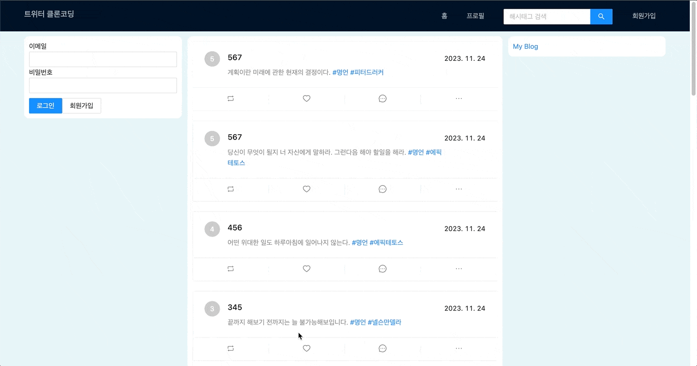

# 트위터 클론 코딩

[클론 사이트 바로가기](http://nodebird.store)

## 📋 Project

풀스택과정을 접해볼 수 있는 트위터 클론 코딩으로 트위터와 비슷하게 기능과 디자인을 구현했습니다.

- redux를 연습하며 이해하고, API호출과 응답에 대해 이해하며 작업했습니다.
- 프론드엔드와 더불어 전반적인 백엔드 서비스의 이해를 얻기 위해 풀스택 강의인 조현영(제로초)님의 "React로 NodeBird SNS 만들기"를 수강하고, 서비스 구현부터 배포까지 진행했습니다.

## 🌟 배포

해당 프로젝트는 AWS를 통해 배포했습니다.
회원가입을 생략하고 싶은 경우 테스트용 아이디를 사용하시면 됩니다.  
ID: 123@naver.com  
PASSWORD: 123

## ⚒️ 사용기술

- `React`
- `Redux`, `Redux-toolkit`
- `Ant Design`, `Styled Components`
- `Express`, `MySQL`, `Sequelize`
- `Next`, `SWR`
- `AWS`

## 📌 전체 기능 및 특징

- 회원가입 / 로그인 구현 및 실시간 업데이트
- 반응형 액션(댓글, 리트윗, 좋아요, 수정, 삭제, 이미지업로드)
- 다이나믹 라우팅
- 팔로우할 유저 추천(유저 팔로우, 언팔로우 가능)

## 🗂️ 페이지별 기능 및 특징

회원가입/로그인

- 회원가입

  - 회원가입시 이미 사용중인 아이디이면, 에러메세지를 보여준다.
    

- 로그인
  - 로그인시 사용자 프로필 보여준다. -> 유저 정보 확인(게시글 / 팔로우 / 팔로워 숫자 확인)
    

Home

- 게시글 로딩
  - 인피니트 스크롤링 - 게시글이 10개씩 업로드되는데, 마지막 게시글까지 스크롤되면 다음 10개의 게시글이 업로드된다.
- 실시간 팔로우 추천 업데이트(팔로우, 언팔로우 가능)
  

프로필

- 닉네임 수정 및 팔로우 / 팔로워 목록 불러오기
- 목록내에 있는 🚫 버튼을 이용하여 언팔로우나 팔로워삭제 가능

게시글

- 게시글 작성 및 수정(실시간 반영), 이미지 업로드
- 좋아요 버튼(토글)
- 댓글 작성
- 리트윗
  - 본인의 게시물은 리트윗하지 못하게 하고, 한번 리트윗한 게시글은 다시 리트윗하지 못하게 하고 에러메세지 보여준다.

